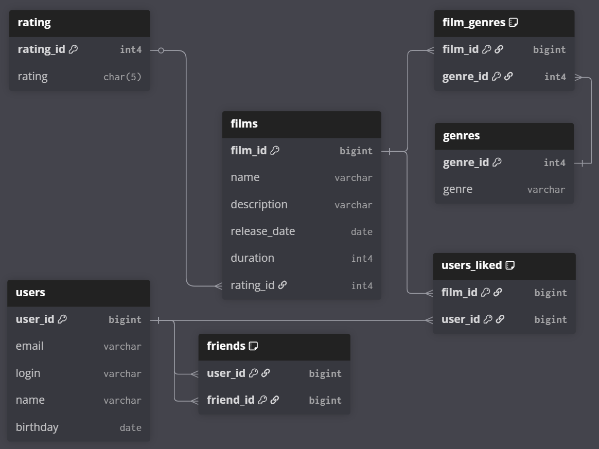

# java-filmorate

---
### Описанные таблицы
- `users` - таблица пользователей
- `friends` - таблица друзей
- `films` - таблица фильмов
- `rating` - справочник рейтингов по версии MPA
- `genres` - справочник жанров
- `film_genres` - таблица фильмов и их жанров
- `users_liked` - таблица пользователей и фильмов, которые они оценили
### Примеры запросов
#### `FIND_ALL_FILMS_GENRES_QUERY`
```sql
SELECT f.film_id, fg.genre_id
FROM films f
JOIN film_genres fg
ON f.film_id = fg.film_id;
```
#### `UPDATE_FILM_ROW_QUERY`
```sql
UPDATE films SET name = ?, description = ?, release_date = ?,
duration = ?, rating_id = ?
WHERE film_id = ?;
```
#### `DELETE_FILM_GENRE_QUERY`
```sql
DELETE FROM film_genres WHERE film_id = ?;
```